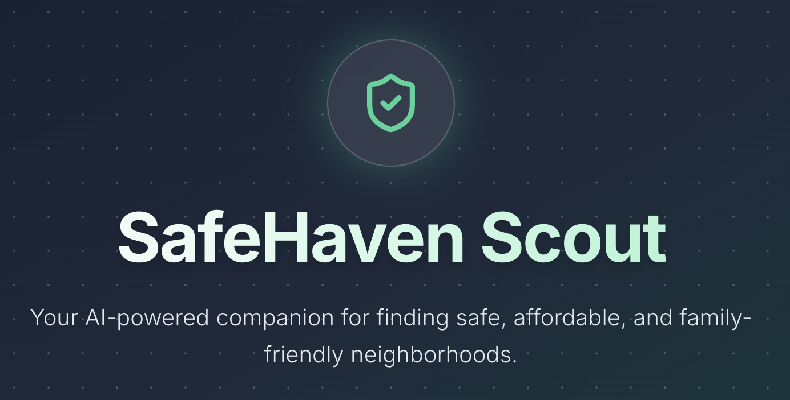

# SafeHaven Scout 🛡️🏡

**AI-Powered Real Estate Safety Analyzer**

> **Course:** CSC 321: Programming Languages  
> **Assignment:** Full-Stack AI Integration Project



## 📖 Project Overview

SafeHaven Scout is an intelligent web application designed to empower renters and homebuyers with qualitative safety insights. Unlike traditional listing sites that focus solely on price and amenities, SafeHaven Scout leverages **Generative AI** to analyze crime trends, neighborhood vibes, and family-friendliness for specific cities.

The application provides users with a curated list of safe zip codes, detailed "Scout Summaries," and visual safety comparisons, all tailored to the user's specific budget and bedroom requirements.

## 🚀 Tech Stack

* **Frontend Framework:** React 19 (TypeScript) + Vite
* **Styling:** Tailwind CSS (Glassmorphism UI design)
* **Artificial Intelligence:** Google Gemini API (Model: `gemini-2.5-flash`)
* **Backend-as-a-Service:** Google Firebase
    * **Authentication:** Firebase Auth (Google Provider)
    * **Database:** Cloud Firestore (NoSQL)
    * **Hosting:** Firebase Hosting
* **Visualization:** Recharts (Data visualization library)
* **Icons:** Lucide React

---

## 🏗️ Architecture & Code Structure

This project demonstrates a modern **Serverless Architecture**, delegating backend logic to Firebase and AI processing to the client-side Gemini Web SDK.

### 1. File Structure Breakdown

The codebase is organized to separate concerns between UI components, data services, and type definitions:

```text
src/
├── components/
│   ├── Hero.tsx          # Landing page visual component
│   ├── SearchForm.tsx    # Main input form (City, State, Budget, Preferences)
│   └── ResultsView.tsx   # Displays AI analysis, charts, and typing-effect summary
├── services/
│   └── geminiService.ts  # The core AI logic layer. Handles prompt engineering,
│                         # API calls to Google Gemini, and JSON schema validation.
├── types.ts              # TypeScript interfaces defining the shape of SearchParams
│                         # and the structured JSON response from the AI.
├── firebaseConfig.ts     # Firebase SDK initialization and service exports (Auth, DB).
├── App.tsx               # Main controller: Handles Auth state, Routing logic,
│                         # and orchestrates data flow between components.
├── index.css             # Tailwind imports and custom CSS animations (blobs/glass).
└── main.tsx              # Entry point
